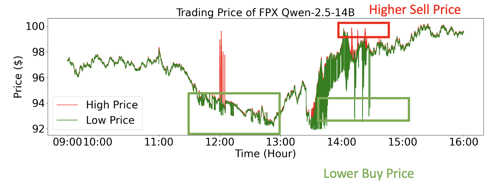

# LSB: Latency Sensitive Benchmarks for LLM Agents.
**[Paper (Win Fast or Lose Slow)](https://arxiv.org/abs/2505.19481) | [Website(Competitve Agents)](https://www.competitive-agent.com/)**
<p align="left"></p><br/>
<!-- <p align="right"></p><br/>
<div style="display: flex; justify-content: center; align-items: center; gap: 2%;">
  
  
</div>
<div style="width: 80%; margin: auto; display: flex; justify-content: center; align-items: center; gap: 2%;">
  
  
</div> -->

Latency Sensitive Benchmarks (LSB) are specifically designed to evaluate LLM Agents in realistic, latency-sensitive scenarios such as competitive games and high-frequency trading. In these tasks, **both latency and accuracy** jointly determine the final reward (e.g., game win rate or trading yield). Unlike previous benchmarks, LSB introduces two novel tasks that not only assess the intelligence of LLM agents, but also rigorously evaluate the efficiency of the underlying serving systems and algorithms. By integrating latency, accuracy, and real-world reward into a unified framework, LSB pioneers a new direction for benchmarking—encouraging the development of efficient, adaptive, and latency-aware LLM systems and algorithms. We hope our benchmarks and findings inspire the community to move beyond accuracy-centric evaluation and to build LLM solutions that truly excel in real-world, time-critical applications. We invite you to try LSB and join us in advancing this exciting frontier!
## Key Features


- **Diverse Benchmarks:** LSB offers two cutting-edge benchmarks， competitive gaming (StreetFighter) and high frequency trading backtesting system, capturing the essence of real-world, latency-sensitive tasks.
- **Flexible Agent Deployment:** Provides LLM agent implementations that support local, remote, and API-based serving, enabling comprehensive evaluation across different system architectures.
- **System-Aware Evaluation:** Highlights how agent performance varies with different serving systems and hardware configurations, offering actionable insights for both algorithm and system optimization.

Experience how LSB can help you benchmark and improve your LLM agents in truly challenging, real-time environments!
## Visualization
### StreetFighter

https://github.com/user-attachments/assets/c69571df-f109-4e92-9e60-60a9cd7933f2


### HFTBench
<p align="left"></p><br/>

## Contents
- [Installation](#installation)
- [QuickStart](#quick-start)
- [Evaluation&Trade-off](#evaluation)
- [Self-define Agent](#self-define-agent)
- [References](#References)

## Installation
### StreetFighter
1. Diambra
```
pip install diambra diambra-arena
```
2. Install [huggingface](https://huggingface.co/docs/transformers/installation#:~:text=pip%20install%20transformers), [vllm](https://docs.vllm.ai/en/stable/getting_started/installation/gpu.html), [sglang](https://docs.sglang.ai/start/install.html).

3. Install other relavant envs
```
pip install loguru llama_index dotenv gymnasium rich openai
```
4. Register your diambra account at [here](https://www.diambra.ai/)
5. Install StreetFighter kernel at [here](https://wowroms.com/en/roms/mame/street-fighter-iii-3rd-strike-fight-for-the-futur-japan-clone/106255.html). And put the zip file(do not unzip it) at $GAME_PATH(wherever you like).
### HFTBench
Install [huggingface](https://huggingface.co/docs/transformers/installation#:~:text=pip%20install%20transformers), [vllm](https://docs.vllm.ai/en/stable/getting_started/installation/gpu.html), [sglang](https://docs.sglang.ai/start/install.html).
Install other relavant envs
```
pip install loguru llama_index dotenv gymnasium rich openai
```

## Quick Start
### StreetFighter
change $GAME_PATH to the root path of where you put the zip file.
```
cd ./StreetFighter
python3 diambra -r $GAME_PATH -l python3 run_api.py --serving-choice huggingface --agent1 Qwen/Qwen3-4B --agent2 Qwen/Qwen3-8B --logdir "test.log" --device1 cuda:0 --device2 cuda:1
```
### HFTBench
```
cd ./HFTBench
python3 Simulation.py --agent_count 1 --device_list cuda:0 
```
## Evaluation
Here we provide results on two RTX5090. More results on H100 are comming soon.

### HFTBench

| Model Parameter Size | Bitwidth Avg | Latency (ms) ↓ | Daily Yield (%) ↑ |
|----------------------|--------------|----------------|--------------------|
| 14B (ours)           | 7.2          | 713            | **26.52**          |
| 14B                 | 8            | 801            | 23.14              |
| 14B                 | 16           | 1302           | 17.20              |
| 7B                  | 16           | 619            | -3.28              |
| 7B (ours)           | 7.6          | 386            | -7.25              |
| 7B                  | 8            | 394            | -12.94             |

### Street Fighter

| Model Parameter Size | Bitwidth Avg | Latency (ms) ↓ | ELO Score ↑ |
|----------------------|--------------|----------------|-------------|
| 3B (ours)            | 6.8          | 195            | **5.99**    |
| 7B (ours)            | 7.2          | 354            | 2.33        |
| 3B                   | 8            | 222            | 2.19        |
| 3B                   | 16           | 349            | 0.25        |
| 7B                   | 8            | 394            | -0.44       |
| 1.5B                 | 8            | 142            | -1.25       |


## Self-define Agent

Comming soon.

## Reference
If you find Win Fast or Lose slow useful or relevant to your research, please kindly cite our paper:
```
@misc{kang2025winfastloseslow,
      title={Win Fast or Lose Slow: Balancing Speed and Accuracy in Latency-Sensitive Decisions of LLMs}, 
      author={Hao Kang and Qingru Zhang and Han Cai and Weiyuan Xu and Tushar Krishna and Yilun Du and Tsachy Weissman},
      year={2025},
      eprint={2505.19481},
      archivePrefix={arXiv},
      primaryClass={cs.LG},
      url={https://arxiv.org/abs/2505.19481}, 
}
```
## Related projects

[Diambra Arena](https://github.com/diambra/arena)

[Polygon Platform](https://polygon.technology/)

## TODOs
1. Self define agent
2. Per-tick data trading with multiple agents
3. FPX support with sglang and vllm engine
